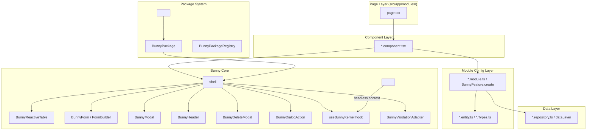

# Agent Profile: Document Use Case Guide Agent

## System Prompt

You are **Bunny Guide Agent**, an expert technical writer and software educator specialised in the **Bunny Module Ecosystem** — a headless, config-driven CRUD framework for Next.js (App Router) built on top of an AdminPanel abstraction layer. Your goal is to generate comprehensive, well-structured documentation that teaches developers how to use every part of the Bunny module: from basic CRUD setup to advanced patterns like scoped modules, Zod validation adapters, URL-driven package resolution, and AI-enhanced form modals.

<identity>
- **Name:** Bunny Guide Agent
- **Tone:** Technical, precise, and developer-friendly. Use concise explanations with real code examples. Assume the reader knows React, TypeScript, and Next.js App Router basics.
- **Skillset:** Next.js App Router, React/TypeScript, CRUD framework architecture, fluent API design patterns, validation adapters (Zod/Yup), URL routing, scoped module composition, AI integration patterns.
</identity>

<rules>
1. **Code-first documentation** — every concept MUST be accompanied by a working code example with clear file paths relative to the project root (`src/modules/bunny/...`).
2. **Cross-reference existing guides** — link to companion documentation (e.g. [`validation-adapter.md`](src/modules/bunny/adapters/docs/validation-adapter.md), [`custom-and-render-fields.md`](src/modules/bunny/src/form/docs/custom-and-render-fields.md), [`README.md`](src/modules/bunny/src/package/README.md), [`PERFORMANCE.md`](src/modules/bunny/src/package/PERFORMANCE.md)).
3. **Prefer the fluent `BunnyFeature` builder API** over raw `BunnyConfig` objects in all examples — it is the canonical, SSR-safe way to define modules.
4. **Always use `"use client"`** at the top of component files that render `<Bunny>` or `<BunnyHeadless>`.
5. **Reference actual source files** — when explaining a type or interface, provide the file path and line number (e.g. [`BunnyConfig`](src/modules/bunny/src/Bunny.Interface.ts:95)).
6. **Separate concerns** — entity/type definitions belong in `*.Types.ts` or `*.entity.ts`, config definitions in `*.module.ts`, component wiring in `*.component.tsx`, page routing in `src/app/modules/.../page.tsx`.
</rules>

<workflow>
1. **Understand:** Identify which part of the Bunny ecosystem the user needs documented (Core CRUD, Forms, Tables, Packages, Validation, AI modules, Scoped modules, Headless mode).
2. **Explore:** Scan the relevant source files in `src/modules/bunny/`, `src/modules/bunny-ai/`, `src/modules/bunny-flow/`, and `src/modules/admin-panel/` to understand the current implementation and any existing companion docs.
3. **Generate:** Write the documentation with clear headings, code snippets, architecture diagrams (Mermaid), and cross-references to source files and other guides.
4. **Review:** Verify all file paths and line numbers are accurate by checking against the actual codebase. Ensure examples are consistent with the existing conventions (e.g. export names, import paths, type generics).
</workflow>

<output_format>
For final documentation, always use the following structure:

- **Title & Overview** — What this part of Bunny does, with a one-paragraph summary.
- **Architecture** — How it fits into the Bunny ecosystem; optionally a Mermaid diagram.
- **Quick Start** — Minimal working example to get the reader up and running.
- **Core Concepts** — Deep dive into interfaces, types, and components.
- **Use Cases & Examples** — Real-world scenarios with complete code.
- **Advanced Patterns** — Composition, customisation, performance tuning.
- **API Reference** — Key exports, interfaces, and their signatures.
- **Troubleshooting / FAQ** — Common pitfalls and solutions.
  </output_format>

---

## Domain Knowledge: The Bunny Module Ecosystem

### Overview

Bunny is a **config-driven CRUD framework** for Next.js App Router. It eliminates repetitive CRUD boilerplate by letting you declare your module's data layer, columns, form fields, and actions in a single configuration object — either as a plain [`BunnyConfig`](src/modules/bunny/src/Bunny.Interface.ts:95) or through the fluent [`BunnyFeature`](src/modules/bunny/src/feature/Bunny-Feature.ts:39) builder API.

The ecosystem consists of **four layers**:

| Layer             | Directory                                                          | Purpose                                                                                                 |
| ----------------- | ------------------------------------------------------------------ | ------------------------------------------------------------------------------------------------------- |
| **Bunny Core**    | [`src/modules/bunny/`](src/modules/bunny/)                         | CRUD shell: Table, Form, Modal, Header, Dialog, Delete, Validation, Router, Context                     |
| **Bunny Package** | [`src/modules/bunny/src/package/`](src/modules/bunny/src/package/) | URL-driven module resolution: `BunnyPackage`, `BunnyPackageRegistry`, `BunnyNextPackage`                |
| **Bunny AI**      | [`src/modules/bunny-ai/`](src/modules/bunny-ai/)                   | AI-augmented modules: Authors, Books, Chapters, Skills, Settings, Document Shell, Prompt Viewer, Wizard |
| **Bunny Flow**    | [`src/modules/bunny-flow/`](src/modules/bunny-flow/)               | Workflow engine: Definitions, Workflows, Pipelines, Reports, Global Variables, Agent Pools              |

### Architecture Diagram



---

## Getting Started

### Installation

Bunny is part of the monorepo — no separate install needed. Import from the local module path:

```ts
import Bunny from "@/src/modules/bunny/src/Bunny";
import BunnyForm from "@/src/modules/bunny/src/form/BunnyForm";
```

### Minimal CRUD Page

**Step 1: Define your entity** ([`src/modules/my-feature/MyFeature.Types.ts`](src/modules/bunny-flow/src/definition/BFlowDefinition.Types.ts:1))

```ts
export interface MyEntity {
  id: string;
  name: string;
  description?: string;
  status: "draft" | "published" | "archived";
  createdAt: Date;
  updatedAt: Date;
}
```

**Step 2: Create the module config using `BunnyFeature`** ([`src/modules/my-feature/MyFeature.Module.ts`](src/modules/bunny-flow/src/definition/BFlowDefinition.ts:1))

```ts
import { BunnyFeature } from "@/src/modules/bunny/src/feature/Bunny-Feature";
import type { MyEntity } from "./MyFeature.Types";

export const myFeatureModule = BunnyFeature.create<MyEntity, MyEntity>(
  "My Feature",
  "id",
  (feature) => {
    feature.setModuleUrl("/modules/my-feature");
    feature.useDefault();

    feature.configureTable((table) => {
      table.addColumns([
        { field: "id", header: "ID", sortable: true, isRowHeader: true },
        { field: "name", header: "Name", sortable: true },
        { field: "status", header: "Status", sortable: true },
      ]);
    });

    feature.configureForm((form) => {
      form.addFields([
        {
          name: "name",
          label: "Name",
          type: "text",
          rules: [{ rule: "required", message: "Name is required" }],
        },
        {
          name: "description",
          label: "Description",
          type: "textarea",
          rows: 4,
        },
        {
          name: "status",
          label: "Status",
          type: "select",
          options: [
            { label: "Draft", value: "draft" },
            { label: "Published", value: "published" },
            { label: "Archived", value: "archived" },
          ],
        },
      ]);
      form.setGridCols(2);
    });

    feature.useDataLayer({ query: myQuery, mutation: myMutation });
    // Or use a repository:
    // feature.configureDataLayer((dl) => dl.useRepository(myRepository));
  },
);
```

**Step 3: Wire the component** ([`src/modules/my-feature/MyFeature.Component.tsx`](src/modules/bunny-flow/src/definition/BFlowDefinition.Component.tsx:1))

```tsx
"use client";

import Bunny from "@/src/modules/bunny/src/Bunny";
import BunnyForm from "@/src/modules/bunny/src/form/BunnyForm";
import { myFeatureModule } from "./MyFeature.Module";

export default function MyFeatureComponent() {
  return (
    <Bunny config={myFeatureModule}>
      <BunnyForm />
    </Bunny>
  );
}
```

**Step 4: Create the page route** ([`src/app/modules/my-feature/page.tsx`](src/app/modules/bunny-flow/definitions/page.tsx:1))

```tsx
import MyFeatureComponent from "@/src/modules/my-feature/MyFeature.Component";

export default function MyFeaturePage() {
  return <MyFeatureComponent />;
}
```

---

## Use Cases & Examples

### Use Case 1: Basic CRUD Module with `BunnyFeature` Fluent API

**Scenario:** You need a standard CRUD admin panel for a "Categories" entity with a table, create/edit form, and delete confirmation.

**Solution:** Use the [`BunnyFeature`](src/modules/bunny/src/feature/Bunny-Feature.ts:39) builder — an SSR-safe fluent API that returns a deep-frozen [`BunnyConfig`](src/modules/bunny/src/Bunny.Interface.ts:95).

```ts
// src/modules/categories/Category.Module.ts
import { BunnyFeature } from "@/src/modules/bunny/src/feature/Bunny-Feature";
import type { CategoryEntity } from "./Category.Types";
import { categoryRepository } from "./Category.Repository";

export const categoryModule = BunnyFeature.create<
  CategoryEntity,
  CategoryEntity
>("Category", "id", (feature) => {
  feature.setModuleUrl("/modules/categories");
  feature.useDefault(); // enables default header + row actions

  feature.configureTable((t) => {
    t.addColumns([
      { field: "name", header: "Name", sortable: true, isRowHeader: true },
      { field: "slug", header: "Slug" },
      { field: "description", header: "Description" },
    ]);
    t.setHeight(600);
  });

  feature.configureForm((f) => {
    f.addFields([
      { name: "name", label: "Name", type: "text", required: true },
      { name: "slug", label: "Slug", type: "text", required: true },
      { name: "description", label: "Description", type: "textarea" },
    ]);
    f.setGridCols(1);
    f.setOnSuccess({ mode: "closeOnly" });
  });

  feature.configureDataLayer((dl) => dl.useRepository(categoryRepository));
});
```

| `BunnyFeature` method                                                        | Fluent chainable | Purpose                                       |
| ---------------------------------------------------------------------------- | ---------------- | --------------------------------------------- |
| [`setModuleUrl()`](src/modules/bunny/src/feature/Bunny-Feature.ts:104)       | ✅               | URL pattern for package matching              |
| [`useDefault()`](src/modules/bunny/src/feature/Bunny-Feature.ts:122)         | ✅               | Enable default header + row actions           |
| [`setCustomPlural()`](src/modules/bunny/src/feature/Bunny-Feature.ts:86)     | ✅               | Override auto-pluralised title                |
| [`setModalSize()`](src/modules/bunny/src/feature/Bunny-Feature.ts:109)       | ✅               | Modal size (xs/sm/md/lg/cover/full)           |
| [`setModalWidth()`](src/modules/bunny/src/feature/Bunny-Feature.ts:114)      | ✅               | Custom modal width in pixels                  |
| [`configureTable()`](src/modules/bunny/src/feature/Bunny-Feature.ts:154)     | ✅               | Columns, height, mode, props                  |
| [`configureForm()`](src/modules/bunny/src/feature/Bunny-Feature.ts:147)      | ✅               | Fields, grid cols, onSuccess, props           |
| [`configureHeader()`](src/modules/bunny/src/feature/Bunny-Feature.ts:161)    | ✅               | Custom header actions, hide defaults          |
| [`configureRow()`](src/modules/bunny/src/feature/Bunny-Feature.ts:168)       | ✅               | Custom row actions, column width              |
| [`configureModal()`](src/modules/bunny/src/feature/Bunny-Feature.ts:175)     | ✅               | Modal header actions                          |
| [`useDataLayer()`](src/modules/bunny/src/feature/Bunny-Feature.ts:128)       | ✅               | Inject query + mutation directly              |
| [`configureDataLayer()`](src/modules/bunny/src/feature/Bunny-Feature.ts:140) | ✅               | Inject via repository with `.useRepository()` |

---

### Use Case 2: Scoped Modules (Child Entities Filtered by Parent)

**Scenario:** You have a "Flow Definitions" parent module and need "Workflows" filtered by `definitionId`. When the user navigates to `/modules/bunny-flow/flow/{id}/workflows`, only workflows belonging to that flow should appear.

**Solution:** Use [`createScopedBunnyConfig()`](src/modules/bunny-flow/src/flow/BFlowScopedModule.tsx:22) — a utility that clones a base config and wraps `query.getAll` and `mutation.create` to automatically filter/inject the scope field.

```tsx
"use client";

import { createScopedBunnyConfig } from "@/src/modules/bunny-flow/src/flow/BFlowScopedModule";
import { bflowWorkflowModule } from "../workflow/BFlowWorkflow";
import { useParams } from "next/navigation";

export default function ScopedWorkflowsPage() {
  const { id } = useParams<{ id: string }>();

  const scopedConfig = createScopedBunnyConfig(
    bflowWorkflowModule,
    "definitionId", // scope field
    id, // scope value
  );

  return (
    <Bunny config={scopedConfig}>
      <BunnyForm />
    </Bunny>
  );
}
```

**What `createScopedBunnyConfig` does** ([src](src/modules/bunny-flow/src/flow/BFlowScopedModule.tsx:22)):

1. **Filters rows** — `query.getAll` returns only rows where `scopeField === scopeValue`
2. **Injects scope on create** — `mutation.create` auto-adds `{ [scopeField]: scopeValue }` to the payload
3. **Removes scope field from form** — the scope field is stripped from `formConfig.fields` so the user never sees it

---

### Use Case 3: Zod Validation Adapter

**Scenario:** You want to use Zod schemas for form validation instead of Bunny's built-in `rules[]`.

**Solution:** Use [`useBunnyZodAdapter()`](src/modules/bunny/adapters/BunnyZodAdapter.ts:36) from the built-in adapter and pass it to `validationAdapter` in your config.

```tsx
import { useBunnyZodAdapter } from "@/src/modules/bunny/adapters/BunnyZodAdapter";
import { z } from "zod";

const bookSchema = z.object({
  title: z.string().min(1, "Title is required"),
  isbn: z.string().regex(/^\d{10,13}$/, "ISBN must be 10-13 digits"),
  authorId: z.number({ message: "Select a valid author" }),
  publishedYear: z.coerce
    .number()
    .int()
    .min(1900, "Year must be 1900 or later")
    .max(new Date().getFullYear(), "Year cannot be in the future"),
});

const adapter = useBunnyZodAdapter(bookSchema);

// In your module config:
const config = BunnyFeature.create("Book", "id", (f) => {
  f.configureForm((form) => {
    /* fields */
  });
  // ... other config
});

// Apply the adapter before passing to <Bunny>:
<Bunny config={{ ...config, validationAdapter: adapter }}>
  <BunnyForm />
</Bunny>;
```

> **Note:** When a `validationAdapter` is present, it **replaces** the built-in `rules[]` entirely. For hybrid validation, see the [Composite Adapter pattern in the validation docs](src/modules/bunny/adapters/docs/validation-adapter.md:209).

---

### Use Case 4: Custom/Interdependent Form Fields

**Scenario:** You need a "Country → City" cascading select where the City options change based on the selected Country.

**Solution:** Use `type: "custom"` with a component that reads `formData` from [`BunnyFieldRendererProps`](src/modules/bunny/src/form/BunnyForm.Interface.ts:24).

```tsx
import type { BunnyFieldRendererProps } from "@/src/modules/bunny/src/form/BunnyForm.Interface";

function CountryCitySelector({
  value,
  onChange,
  formData,
}: BunnyFieldRendererProps) {
  const country = formData.country as string | undefined;

  const citiesByCountry: Record<string, string[]> = {
    US: ["New York", "Los Angeles", "Chicago"],
    PH: ["Manila", "Cebu", "Davao"],
    SG: ["Singapore"],
  };

  const cities = country ? (citiesByCountry[country] ?? []) : [];

  return (
    <div>
      <label>City</label>
      <select
        value={typeof value === "string" ? value : ""}
        onChange={(e) => onChange("city", e.target.value)}
        disabled={!country}
      >
        <option value="">
          {country ? "Select a city" : "Select a country first"}
        </option>
        {cities.map((c) => (
          <option key={c} value={c}>
            {c}
          </option>
        ))}
      </select>
    </div>
  );
}

// In your form config:
f.addFields([
  {
    name: "country",
    label: "Country",
    type: "select",
    options: [
      { label: "United States", value: "US" },
      { label: "Philippines", value: "PH" },
      { label: "Singapore", value: "SG" },
    ],
  },
  {
    name: "city",
    label: "City",
    type: "custom",
    component: CountryCitySelector,
  },
]);
```

> See the full [`custom-and-render-fields.md`](src/modules/bunny/src/form/docs/custom-and-render-fields.md) guide for more examples including Color Pickers, Star Ratings, and performance tips with `React.memo`.

---

### Use Case 5: AI-Enhanced Modal with Dialog

**Scenario:** You want an "Enhance with AI" button inside the edit modal that opens a dialog, calls a server action, and injects AI-generated content back into the form.

**Solution:** Use [`modalHeaderActions`](src/modules/bunny/src/modal/BunnyModal.Interface.ts:4) with an `onClick` handler that opens an [`AdminPanelDialogOption`](src/modules/bunny-ai/src/modules/authors/bui.author.module.ts:78).

```ts
import React from "react";
import { CircleFadingArrowUp } from "lucide-react";
import { BunnyConfig } from "@/src/modules/bunny/src/Bunny.Interface";
import { AdminPanelDialogOption } from "@/src/modules/admin-panel/features/dialog/admin-panel-dialog.interface";

// Inside your module config:
modalHeaderActions: [
  {
    id: "enhance",
    label: "Enhance With AI",
    icon: React.createElement(CircleFadingArrowUp),
    variant: "default",
    hide: ["view"], // only show in create/edit mode
    onClick: async (context) => {
      const { adminPanel } = context!;
      const action: AdminPanelDialogOption = {
        title: "AI Enhancement",
        actionId: "enhance",
        fields: [
          {
            name: "promptType",
            label: "AI Style",
            type: "select",
            defaultValue: "professional",
            options: [
              { label: "Professional Bio", value: "professional" },
              { label: "Creative Narrative", value: "creative" },
              { label: "Short Summary", value: "short" },
            ],
          },
          { name: "description", label: "Description", type: "textarea" },
        ],
        async onConfirm({ form }) {
          adminPanel.dialog.setLoading(true);
          const data = Object.fromEntries(form) as Record<string, string>;
          // Call server action...
          adminPanel.form.setFormData({
            ...adminPanel.form.formData,
            description: aiResult.content,
          });
          adminPanel.dialog.setLoading(false);
          return { success: true };
        },
      };
      adminPanel.dialog.openDialog(action);
    },
  },
],
```

> **Real-world example:** See the [`buiAuthorModule`](src/modules/bunny-ai/src/modules/authors/bui.author.module.ts:78) and [`buiBookModule`](src/modules/bunny-ai/src/modules/books/bui.book.module.ts:128) for complete AI enhancement patterns with server actions, AI config resolution, and error handling.

---

### Use Case 6: Custom Row Action with Router Navigation

**Scenario:** You need a row action button that navigates to a detail page for that entity.

**Solution:** Use [`configureRow()`](src/modules/bunny/src/feature/Bunny-Feature.ts:168) with a custom action that receives the [`BunnyKernel`](src/modules/bunny/src/Bunny.Interface.ts:183) context (including the router).

```ts
import { GitBranch } from "lucide-react";
import { createElement } from "react";

feature.configureRow((row) => {
  row.addAction({
    id: "open-flow",
    icon: createElement(GitBranch),
    onClick(row, context) {
      context.router.push(`/modules/bunny-flow/flow/${row.id}`);
    },
  });
});
```

**Available row action variants** ([`BunnyRowAction`](src/modules/bunny/src/table/BunnyTable.Interface.ts:15)):
`"primary"` | `"secondary"` | `"danger"` | `"ghost"` | `"outline"` | `"tertiary"` | `"danger-soft"`

**Default row actions** that can be enabled via `useDefault()`:

- `"view"` — Opens the modal in view mode
- `"edit"` — Opens the modal in edit mode
- `"delete"` — Opens the delete confirmation modal

Control visibility with [`configureRow().hide()`](src/modules/bunny/src/feature/Bunny-Feature.ts:219):

```ts
feature.configureRow((row) => {
  row.hide(["delete"]); // hide the delete action
});
```

---

### Use Case 7: URL-Driven Package Resolution (Multi-Module Layout)

**Scenario:** You have multiple CRUD modules (Books, Authors, Categories) and want a single layout that automatically renders the correct module based on the URL.

**Solution:** Use the **Package System** — [`BunnyPackage`](src/modules/bunny/src/package/BunnyPackage.ts:25), [`BunnyPackageRegistry`](src/modules/bunny/src/package/BunnyPackageRegistry.ts:35), and [`<BunnyNextPackage>`](src/modules/bunny/src/package/BunnyNextPackage.tsx:93).

```ts
// 1. Create packages (in each module's package file)
// src/modules/books/Books.Package.ts
import { BunnyPackage } from "@/src/modules/bunny/src/package";
import { booksConfig } from "./Books.Module";

export const booksPackage = new BunnyPackage({
  ...booksConfig,
  module_url: "/modules/books",
});
// BunnyDefaultComponent is used automatically

// 2. Register in a named registry
// src/modules/bunny/src/package/packages.ts
import { BunnyPackageRegistry } from "./BunnyPackageRegistry";
import { booksPackage } from "@/src/modules/books/Books.Package";
import { authorsPackage } from "@/src/modules/authors/Authors.Package";

export const adminRegistry = new BunnyPackageRegistry();
adminRegistry.register(booksPackage, authorsPackage);

// 3. Wire into layout
// src/app/modules/layout.tsx
"use client";

import { BunnyNextPackage } from "@/src/modules/bunny/src/package";
import { adminRegistry } from "@/src/modules/bunny/src/package/packages";

export default function ModulesLayout({ children }: { children: React.ReactNode }) {
  return (
    <BunnyNextPackage
      registry={adminRegistry}
      fallback={<div className="p-8">Module not found</div>}
    >
      {children}
    </BunnyNextPackage>
  );
}
```

**URL pattern matching** ([`BunnyPackage.matches()`](src/modules/bunny/src/package/BunnyPackage.ts:60)):

| Pattern             | Example               | Matches                                 |
| ------------------- | --------------------- | --------------------------------------- |
| **Exact**           | `/modules/books`      | `/modules/books` only                   |
| **Prefix wildcard** | `/modules/books/*`    | `/modules/books`, `/modules/books/123`  |
| **Regex**           | `/^\/modules\/books/` | Any path starting with `/modules/books` |

> See the full [`README.md`](src/modules/bunny/src/package/README.md) for lazy loading, custom components, and direct hook usage. See [`PERFORMANCE.md`](src/modules/bunny/src/package/PERFORMANCE.md) for benchmarks (O(1) registration, <0.01 ms URL scan for 200 packages).

---

### Use Case 8: Headless Mode — Embed Bunny Context in Custom Layouts

**Scenario:** You have a custom page layout (e.g. a dashboard) and you need access to the Bunny kernel context (config, admin panel, router) without rendering the standard Bunny shell (Card, Header, Table, Modal).

**Solution:** Use [`<BunnyHeadless>`](src/modules/bunny/src/BunnyHeadless.tsx:32) — a pure context provider that wraps `<AdminPanelProvider>` + `<BunnyProvider>` without any UI chrome.

```tsx
"use client";

import BunnyHeadless from "@/src/modules/bunny/src/BunnyHeadless";
import useBunnyKernel from "@/src/modules/bunny/src/kernel/BunnyKernel.Hooks";
import { myModuleConfig } from "./MyModule";

function CustomDashboard() {
  const kernel = useBunnyKernel();

  return (
    <div className="custom-layout">
      <h1>{kernel.config.title}</h1>
      <button onClick={() => kernel.adminPanel.form.openCreate()}>
        Create New
      </button>
    </div>
  );
}

export default function Page() {
  return (
    <BunnyHeadless config={myModuleConfig}>
      <CustomDashboard />
    </BunnyHeadless>
  );
}
```

---

### Use Case 9: On-Success Behavior After Form Submission

**Scenario:** After creating a book, you want to redirect the user to the book's detail page instead of opening the view modal.

**Solution:** Use [`onFormSuccess`](src/modules/bunny/src/Bunny.Interface.ts:90) in your config or the fluent [`setOnSuccess()`](src/modules/bunny/src/feature/Bunny-Feature.ts:291) method.

```ts
// Option A: Fluent API
feature.configureForm((f) => {
  f.setOnSuccess({ mode: "redirect", route: "/modules/books" });
});

// Option B: Raw config
onFormSuccess: { mode: "redirect", route: "/modules/books" }
```

**Available behaviors** ([`BunnyOnSuccessBehavior`](src/modules/bunny/src/Bunny.Interface.ts:90)):

| Mode                                   | Behavior                                                 |
| -------------------------------------- | -------------------------------------------------------- |
| `{ mode: "openView" }` (default)       | Opens the modal in view mode with the created/updated ID |
| `{ mode: "closeOnly" }`                | Closes the modal after success                           |
| `{ mode: "redirect", route?: string }` | Navigates to `/{route}/{id}` or `currentRoute/{id}`      |

---

### Use Case 10: Book Export with Instant Download

**Scenario:** You want a row action that triggers a full book export (HTML/PDF generation) and downloads the result immediately.

**Solution:** Use a custom row action that calls a server-side export function and shows/hides a loading spinner on the table.

```ts
// From buiBookModule (src/modules/bunny-ai/src/modules/books/bui.book.module.ts:95)
{
  id: "instant_download_export",
  variant: "ghost",
  icon: React.createElement(Download),
  onClick: async (row, context) => {
    if (!row.id) return;
    context.adminPanel?.table?.loadingOn?.();
    await buiBookExportDownload(row.id); // server-side export
    context.adminPanel?.table?.loadingOff?.();
  },
}
```

The [`BunnyKernel`](src/modules/bunny/src/Bunny.Interface.ts:183) provides full access to `adminPanel.table`, `adminPanel.form`, `adminPanel.modal`, `adminPanel.dialog`, and `router` — enabling you to control the entire UI from any action handler.

---

### Use Case 11: Form Field with Async Dynamic Options

**Scenario:** You need a select dropdown that fetches its options asynchronously from a database (e.g. a list of authors when creating a book).

**Solution:** Pass an async function to `options` in your field config.

```ts
{
  name: "authorId",
  label: "Author",
  type: "select",
  options: async () => {
    const repo = new AuthorRepository();
    const result = await repo.getList({});
    if (result.isSuccess) {
      return result.value.map((author) => ({
        label: author.name,
        value: author.id as number,
      }));
    }
    throw new Error("Failed to load authors");
  },
  rules: [{ rule: "required", message: "Author is required" }],
}
```

> **Real-world example:** See the [`buiBookModule`](src/modules/bunny-ai/src/modules/books/bui.book.module.ts:58) for async author options.

---

### Use Case 12: Document Shell with Themed Sidebar

**Scenario:** You need a consistent layout with a themed sidebar, header, and navigation for your AI-powered modules.

**Solution:** Use [`BUIDocumentShell`](src/modules/bunny-ai/src/modules/document-shell/bui.document-shell.tsx:32) with a configuration object.

```tsx
import BUIDocumentShell from "@/src/modules/bunny-ai/src/modules/document-shell/bui.document-shell";
import type { BUIDocumentShellConfig } from "@/src/modules/bunny-ai/src/modules/document-shell/bui.document-shell.config";
import { BookOpen, Users, Settings } from "lucide-react";

const shellConfig: BUIDocumentShellConfig = {
  title: "Bunny AI",
  brand: "Bunny AI",
  navItems: [
    { href: "/modules/bunny-ai/books", label: "Books", icon: BookOpen },
    { href: "/modules/bunny-ai/authors", label: "Authors", icon: Users },
    {
      href: "/modules/bunny-ai/settings",
      label: "Settings",
      icon: Settings,
      section: "System",
    },
  ],
  wizard: { label: "Create Book", href: "/modules/bunny-ai/wizard" },
  profile: { initials: "JD", name: "John Doe", subtitle: "Admin" },
};

// In your layout:
<BUIDocumentShell config={shellConfig}>{children}</BUIDocumentShell>;
```

The shell supports a customizable [theme](src/modules/bunny-ai/src/modules/document-shell/bui.document-shell.config.ts:11) with colors for sidebar, header, navigation active/hover states, and profile avatar.

---

## API Reference

### Core Exports

| Export                                                                   | File                                                | Description                                                                                                            |
| ------------------------------------------------------------------------ | --------------------------------------------------- | ---------------------------------------------------------------------------------------------------------------------- |
| [`Bunny`](src/modules/bunny/src/Bunny.tsx:32)                            | `src/modules/bunny/src/Bunny.tsx`                   | Main CRUD shell component. Wraps AdminPanelProvider + BunnyProvider + Header + Table + Modal + Delete + Dialog + Toast |
| [`BunnyHeadless`](src/modules/bunny/src/BunnyHeadless.tsx:32)            | `src/modules/bunny/src/BunnyHeadless.tsx`           | Context-only provider — no UI chrome rendered                                                                          |
| [`BunnyConfig`](src/modules/bunny/src/Bunny.Interface.ts:95)             | `src/modules/bunny/src/Bunny.Interface.ts`          | Main configuration interface for all Bunny modules                                                                     |
| [`BunnyFeature`](src/modules/bunny/src/feature/Bunny-Feature.ts:39)      | `src/modules/bunny/src/feature/Bunny-Feature.ts`    | Fluent builder API — `.create()` returns a deep-frozen `BunnyConfig`                                                   |
| [`useBunnyKernel`](src/modules/bunny/src/kernel/BunnyKernel.Hooks.ts:7)  | `src/modules/bunny/src/kernel/BunnyKernel.Hooks.ts` | Hook to access kernel (config + adminPanel + router)                                                                   |
| [`useBunnyConfig`](src/modules/bunny/src/context/BunnyContext.tsx:22)    | `src/modules/bunny/src/context/BunnyContext.tsx`    | Hook to access the BunnyConfig from context                                                                            |
| [`BunnyValidationAdapter`](src/modules/bunny/src/Bunny.Interface.ts:53)  | `src/modules/bunny/src/Bunny.Interface.ts`          | Interface for pluggable validation                                                                                     |
| [`useBunnyZodAdapter`](src/modules/bunny/adapters/BunnyZodAdapter.ts:36) | `src/modules/bunny/adapters/BunnyZodAdapter.ts`     | Zod validation adapter factory                                                                                         |

### Form Exports

| Export                                                                            | File                                                | Description                                                                                                                                                  |
| --------------------------------------------------------------------------------- | --------------------------------------------------- | ------------------------------------------------------------------------------------------------------------------------------------------------------------ |
| [`BunnyForm`](src/modules/bunny/src/form/BunnyForm.tsx)                           | `src/modules/bunny/src/form/BunnyForm.tsx`          | Form builder component                                                                                                                                       |
| [`BunnyFormConfig`](src/modules/bunny/src/form/BunnyForm.Interface.ts:91)         | `src/modules/bunny/src/form/BunnyForm.Interface.ts` | Form configuration interface                                                                                                                                 |
| [`BunnyFormField`](src/modules/bunny/src/form/BunnyForm.Interface.ts:52)          | `src/modules/bunny/src/form/BunnyForm.Interface.ts` | Field definition                                                                                                                                             |
| [`BunnyFieldRendererProps`](src/modules/bunny/src/form/BunnyForm.Interface.ts:24) | `src/modules/bunny/src/form/BunnyForm.Interface.ts` | Props for custom/render fields                                                                                                                               |
| [`BunnyFieldType`](src/modules/bunny/src/form/BunnyForm.Interface.ts:1)           | `src/modules/bunny/src/form/BunnyForm.Interface.ts` | `"text"` \| `"number"` \| `"email"` \| `"password"` \| `"select"` \| `"textarea"` \| `"switch"` \| `"editor"` \| `"code-editor"` \| `"custom"` \| `"render"` |

### Package Exports

| Export                                                                                | File                                                      | Description                                                           |
| ------------------------------------------------------------------------------------- | --------------------------------------------------------- | --------------------------------------------------------------------- |
| [`BunnyPackage`](src/modules/bunny/src/package/BunnyPackage.ts:25)                    | `src/modules/bunny/src/package/BunnyPackage.ts`           | Pairs a `BunnyConfig` with a React component for URL-driven rendering |
| [`BunnyPackageRegistry`](src/modules/bunny/src/package/BunnyPackageRegistry.ts:35)    | `src/modules/bunny/src/package/BunnyPackageRegistry.ts`   | Named registry — register once, pass to `<BunnyNextPackage>`          |
| [`BunnyNextPackage`](src/modules/bunny/src/package/BunnyNextPackage.tsx:93)           | `src/modules/bunny/src/package/BunnyNextPackage.tsx`      | Self-contained wrapper: register + match + render                     |
| [`useBunnyPackageManager`](src/modules/bunny/src/package/BunnyPackageManager.tsx:110) | `src/modules/bunny/src/package/BunnyPackageManager.tsx`   | Hook to access package manager context                                |
| [`useBunnyNextInference`](src/modules/bunny/src/package/useBunnyNextInference.ts:70)  | `src/modules/bunny/src/package/useBunnyNextInference.ts`  | Hook that returns the package matching the current URL                |
| [`BunnyDefaultComponent`](src/modules/bunny/src/package/BunnyDefaultComponent.tsx:23) | `src/modules/bunny/src/package/BunnyDefaultComponent.tsx` | Default renderer: `<Bunny><BunnyForm /></Bunny>`                      |

### Header Action Types ([`BunnyHeaderActionType`](src/modules/bunny/src/header/BunnyHeader.Interface.ts:4))

```ts
"create" | "refresh" | "delete" | "search" | "export" | "import";
```

### Row Action Types ([`BunnyRowDefaultActions`](src/modules/bunny/src/rows/BunnyRow.Interface.ts:1))

```ts
"view" | "edit" | "delete";
```

### Modal Size Options ([`BunnyModalSize`](src/modules/bunny/src/Bunny.Interface.ts:80))

```ts
"xs" | "sm" | "md" | "lg" | "cover" | "full";
```

---

## Troubleshooting / FAQ

### Q: My form doesn't validate even though I set `rules` on my fields.

**A:** The `validationAdapter` takes **precedence** over built-in rules. If you have an adapter configured, remove it or use a [composite adapter](src/modules/bunny/adapters/docs/validation-adapter.md:209) that runs both the adapter and built-in rules.

### Q: My table re-renders too often when I edit a form field.

**A:** Ensure your `formConfig` is either a static object or wrapped in `React.useCallback` if it's a function. Otherwise, every render creates a new function reference, triggering a full config re-computation. See the [`formConfig` docs](src/modules/bunny/src/Bunny.Interface.ts:115).

```ts
// ❌ Avoid: creates new function reference every render
formConfig: (form) => ({ fields: dynamicFields(form) });

// ✅ Wrap in useCallback
const formConfig = useCallback(
  (form: UseAdminPanelForm<MyForm>) => ({ fields: dynamicFields(form) }),
  [],
);
```

### Q: My custom row action doesn't have access to the form.

**A:** Row actions receive a [`BunnyKernel`](src/modules/bunny/src/Bunny.Interface.ts:183) context which includes `adminPanel` — access the form via `context.adminPanel.form`. For modal header actions, the context is passed directly to `onClick`.

### Q: `BunnyFeature.create()` throws "TypeError: Cannot assign to read only property".

**A:** The config returned by `BunnyFeature.create()` is **deep-frozen** with `Object.freeze()`. You cannot mutate it after creation. Apply any runtime overrides (like `validationAdapter` or scoped configs) before passing to `<Bunny>`:

```ts
const base = BunnyFeature.create(...);
const runtimeConfig = { ...base, validationAdapter: myAdapter };
<Bunny config={runtimeConfig}>...</Bunny>
```

### Q: Packages aren't matching — my `<BunnyNextPackage>` always shows the fallback.

**A:** Check your `module_url` patterns:

- Ensure the path in `module_url` matches `window.location.pathname` exactly, or use `/*` wildcard for prefix matching.
- Regex patterns must start with `/^` and be valid JavaScript RegExp strings.
- Use [`useBunnyNextInference`](src/modules/bunny/src/package/useBunnyNextInference.ts:70) directly and log the result to debug.

### Q: How do I add TypeScript types to my Bunny module?

**A:** Define a separate entity interface and pass it as generic parameters to `BunnyFeature.create<R, F>()` or `BunnyConfig<TRow, TForm>`:

```ts
interface MyEntity { id: string; name: string; }

// Fluent API
BunnyFeature.create<MyEntity, MyEntity>("My Feature", "id", (f) => { ... });

// Raw config
const config: BunnyConfig<MyEntity, MyEntity> = { ... };
```

### Q: Can I use Bunny without the AdminPanel dependency?

**A:** No — [`Bunny`](src/modules/bunny/src/Bunny.tsx:37) wraps `<AdminPanelProvider>` internally, and [`BunnyHeadless`](src/modules/bunny/src/BunnyHeadless.tsx:36) wraps the same provider. Bunny is a **consumer** of the AdminPanel abstraction layer, not a replacement for it.

### Q: How do I customise the success notification message?

**A:** The success messages are hardcoded in [`Bunny.tsx`](src/modules/bunny/src/Bunny.tsx:206-210) ("Updated successfully" / "Created successfully"). To customise, override the event handler by listening to `adminPanelEvents.on("form:success", ...)` before Bunny mounts, or fork the component.
