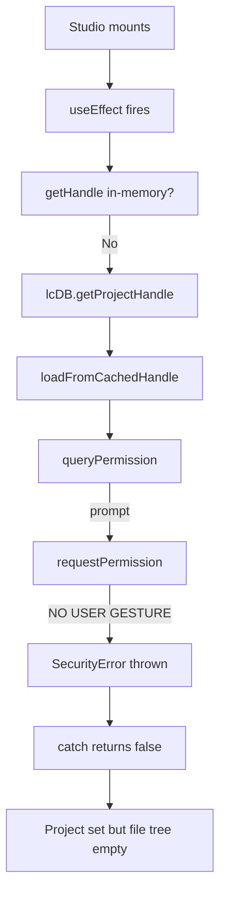
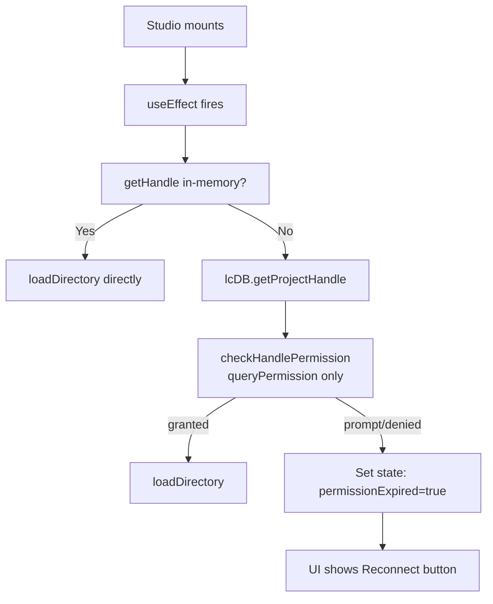

# Fix: `requestPermission` User Activation Error

## Problem

The browser's File System Access API requires `requestPermission()` on a `FileSystemHandle` to be called **within a user activation** (a direct user gesture like `click`). Calling it outside a gesture — e.g., from a `useEffect` or after multiple `await` hops — throws:

```
SecurityError: Failed to execute 'requestPermission' on 'FileSystemHandle': 
  User activation is required to request permissions.
```

## Affected Code Paths

### Path A — `LCStudio.tsx` `useEffect` auto-restore (lines 122–156)

This `useEffect` runs automatically on component mount, **not from a user gesture**. It calls `loadFromCachedHandle()` which internally calls `requestPermission()`. **This will always fail.**



### Path B — Click handler in `LCApp.tsx` `handleSelectRecentProject` (lines 295–324)

The click starts from a user gesture, but by the time `requestPermission` runs — after IndexedDB reads/writes (`selectRecentProject` → `updateLastOpened` + `getProjectHandle`) — the user activation may have expired.

### Path C — Click handler in `LCStudio.tsx` `handleSelectRecentProject` (lines 251–274)

Same issue as Path B.

---

## Can the user keep the project ID when permission fails?

**Yes.** The project entry (`LCProject`) is stored in Dexie/IndexedDB **before** any permission check. Look at the flow in [`selectRecentProject`](src/modules/lemon-coder/src/useLCProject.ts:88):

```
setCurrentProject(project);          // Sync — always succeeds
await lcDB.updateLastOpened(project.id);  // Writes to Dexie — always succeeds
await lcDB.getProjectHandle(project.id);  // Reads from Dexie — always succeeds
```

The Dexie project entry persists across page refreshes. The project ID (`LCProject.id`) is never lost. Only the **cached directory handle's permission** expires, which is a browser security boundary that can be re-acquired by the user clicking again.

---

## Solution

### Principle

Separate the **permission query** (safe anywhere, no gesture needed) from the **permission request** (requires user gesture). Never call `requestPermission` from a `useEffect` or after multiple `await` hops that may exhaust user activation.

### Step 1 — Refactor `loadFromCachedHandle` in `useLCFileSystem.ts`

**Goal:** Split into two functions — one for query-only (safe in effects), one that can request permission.

#### Changes in `useLCFileSystem.ts`:

1. Add a new **`checkHandlePermission`** function that uses only `queryPermission()` — safe to call from `useEffect`:

```typescript
/**
 * Check permission on a cached handle WITHOUT requesting.
 * Safe to call outside user gesture (no requestPermission call).
 * Returns "granted" | "prompt" | "denied".
 */
async function checkHandlePermission(
  dirHandle: FileSystemDirectoryHandle
): Promise<FileSystemPermissionState> {
  const handle = dirHandle as unknown as import("browser-fs-access").FileSystemHandle;
  return handle.queryPermission({ mode: "readwrite" });
}
```

2. Modify `loadFromCachedHandle` to **never** call `requestPermission` itself. Instead:
   - If "granted" → load immediately
   - If "prompt" or "denied" → return `false` (caller must handle)

```typescript
const loadFromCachedHandle = useCallback(
  async (dirHandle: FileSystemDirectoryHandle): Promise<boolean> => {
    try {
      const permission = await checkHandlePermission(dirHandle);
      if (permission !== "granted") {
        console.warn(
          "[lemon-coder] Cached handle permission not granted (" + permission + 
          ") — caller must re-request within a user gesture."
        );
        return false;
      }
      await loadDirectory(dirHandle);
      return true;
    } catch (error) {
      console.error("[lemon-coder] Failed to use cached directory handle:", error);
      return false;
    }
  },
  [loadDirectory],
);
```

3. Add a new **`requestHandlePermission`** function that click handlers can call directly within the user gesture:

```typescript
/**
 * Request readwrite permission on a cached handle.
 * MUST be called within a user gesture (click handler).
 * Returns true if permission was granted.
 */
async function requestHandlePermission(
  dirHandle: FileSystemDirectoryHandle
): Promise<boolean> {
  try {
    const handle = dirHandle as unknown as import("browser-fs-access").FileSystemHandle;
    const permission = await handle.requestPermission({ mode: "readwrite" });
    return permission === "granted";
  } catch (error) {
    console.error("[lemon-coder] Failed to request handle permission:", error);
    return false;
  }
}
```

4. Export `requestHandlePermission` from the hook's return interface.

### Step 2 — Fix `LCStudio.tsx` `useEffect` (Path A)

Change the effect to use `checkHandlePermission` (no gesture needed) instead of `loadFromCachedHandle`:



**Change in `LCStudio.tsx`:**
- Replace `loadFromCachedHandle(cached.dirHandle)` with a new path that first calls `checkHandlePermission` (or just `queryPermission` directly), then either loads or sets a `permissionExpired` state.

### Step 3 — Fix click handlers to call `requestPermission` early (Paths B & C)

Restructure click handlers so `requestPermission` runs as early as possible in the async chain, before IndexedDB operations.

#### In `LCApp.tsx` `handleSelectRecentProject`:

Current flow:
```
click → selectRecentProject (await DB writes) → loadFromCachedHandle (query + request)
```

New flow:
```
click → find project → setCurrentProject (sync) 
      → getProjectHandle (await DB read)
      → requestHandlePermission (early, still in gesture)
      → if granted → loadDirectory
      → updateLastOpened (after)
```

### Step 4 — Add Reconnect UI to `LCStudio.tsx`

When permission expires (detected by `useEffect` or after a failed click handler attempt), show an in-app overlay/banner:

- **State:** `permissionExpired: boolean`
- **UI:** A banner at the top of the studio: "Project folder access expired. [Click to reconnect]"
- **Handler:** When user clicks reconnect, call `requestHandlePermission` (now inside a user gesture), then load the directory.

### Step 5 — Update the `UseLCFileSystemReturn` interface

Expose `requestHandlePermission` from the hook so components can call it from their click handlers.

---

## Files to Modify

| File | Changes |
|------|---------|
| [`src/modules/lemon-coder/src/useLCFileSystem.ts`](src/modules/lemon-coder/src/useLCFileSystem.ts) | Refactor `loadFromCachedHandle`; add `checkHandlePermission` and `requestHandlePermission`; update return interface |
| [`src/modules/lemon-coder/src/LCStudio.tsx`](src/modules/lemon-coder/src/LCStudio.tsx) | Fix `useEffect` to use `queryPermission` only; add `permissionExpired` state and reconnect UI |
| [`src/modules/lemon-coder/src/LCApp.tsx`](src/modules/lemon-coder/src/LCApp.tsx) | Restructure `handleSelectRecentProject` to call `requestPermission` before IndexedDB ops |
| [`src/modules/lemon-coder/src/LCLandingScreen.tsx`](src/modules/lemon-coder/src/LCLandingScreen.tsx) | Optional: Minor UI updates if needed for permission state |
| [`src/modules/lemon-coder/src/LCStudio.tsx`](src/modules/lemon-coder/src/LCStudio.tsx) | Also fix `handleSelectRecentProject` here to match the same pattern |

---

## Execution Order

1. **`useLCFileSystem.ts`** — Refactor permission logic (add `checkHandlePermission`, `requestHandlePermission`, modify `loadFromCachedHandle`)
2. **`LCStudio.tsx`** — Fix `useEffect` auto-restore; add permission-expired state + reconnect UI
3. **`LCApp.tsx`** — Restructure `handleSelectRecentProject` 
4. **`LCStudio.tsx`** — Restructure `handleSelectRecentProject` (same pattern)
