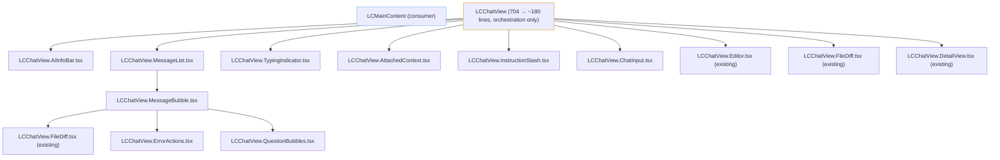
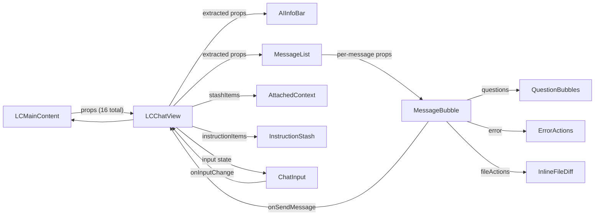

# Refactoring Plan: Decompose LCChatView.tsx

## Current State

[`LCChatView.tsx`](src/modules/lemon-coder/src/LCChatView.tsx) is **704 lines** with multiple distinct UI sections rendered inline. The component already established a good pattern with child components like [`LCChatView.DetailView.tsx`](src/modules/lemon-coder/src/LCChatView.DetailView.tsx), [`LCChatView.Editor.tsx`](src/modules/lemon-coder/src/LCChatView.Editor.tsx), and [`LCChatView.FileDiff.tsx`](src/modules/lemon-coder/src/LCChatView.FileDiff.tsx) — but several large sections remain inline.

## Architecture & Component Tree (After Refactor)

## Extracted Components

### 1. [`LCChatView.AIInfoBar.tsx`](src/modules/lemon-coder/src/LCChatView.AIInfoBar.tsx) (NEW)
**Responsibility:** Display the top bar with AI provider info, model label, and session title.

**Props:**
- `providerLabel: string`
- `modelLabel: string`
- `sessionTitle?: string`
- `stashCount: number`

**Source lines:** 210–236 from [`LCChatView.tsx`](src/modules/lemon-coder/src/LCChatView.tsx)

### 2. [`LCChatView.MessageList.tsx`](src/modules/lemon-coder/src/LCChatView.MessageList.tsx) (NEW)
**Responsibility:** Render the full list of messages, the empty state, and the typing indicator. Handles auto-scroll logic.

**Props:**
- `messages: LCChatMessage[]`
- `isSending: boolean`
- `latestFileActions: LCFileActionResult[] | null`
- `onSendMessage: (content: string) => void`
- `onApplyFileChanges: (fileActions: LCFileActionResult[]) => void`
- `onPreviewDiff?: (fileAction: LCFileActionResult) => void`
- `onReadFileForDiff?: (filePath: string) => Promise<string>`
- `onRetryMessage?: (content: string) => void`
- `promptMode?: LCPromptModeType`

**Source lines:** 239–508

### 3. [`LCChatView.MessageBubble.tsx`](src/modules/lemon-coder/src/LCChatView.MessageBubble.tsx) (NEW)
**Responsibility:** Render a single message — avatar, bubble content (markdown vs plain text), copy button, context file badges, question bubbles, error actions, and file action inlines.

**Props:**
- `msg: LCChatMessage`
- `isLatestWithFiles: boolean`
- `promptMode?: LCPromptModeType`
- `onSendMessage: (content: string) => void`
- `onApplyFileChanges: (fileActions: LCFileActionResult[]) => void`
- `onPreviewDiff?: (fileAction: LCFileActionResult) => void`
- `onReadFileForDiff?: (filePath: string) => Promise<string>`
- `onRetryMessage?: (content: string) => void`

**Source lines:** 262–492

### 4. [`LCChatView.QuestionBubbles.tsx`](src/modules/lemon-coder/src/LCChatView.QuestionBubbles.tsx) (NEW)
**Responsibility:** Render the selectable question/option bubbles from Plan mode responses.

**Props:**
- `questions: string[]`
- `promptMode?: LCPromptModeType`
- `onSendMessage: (content: string) => void`

**Source lines:** 388–415 from [`LCChatView.tsx`](src/modules/lemon-coder/src/LCChatView.tsx)

### 5. [`LCChatView.ErrorActions.tsx`](src/modules/lemon-coder/src/LCChatView.ErrorActions.tsx) (NEW)
**Responsibility:** Render the error chip + "View Details" + "Retry" buttons for failed messages.

**Props:**
- `error: LCErrorInfo`
- `onViewDetails: () => void`
- `onRetryMessage?: (content: string) => void`

**Source lines:** 418–449

### 6. [`LCChatView.TypingIndicator.tsx`](src/modules/lemon-coder/src/LCChatView.TypingIndicator.tsx) (NEW)
**Responsibility:** Render the "Thinking..." animated indicator while AI is processing.

**Props:** None (pure presentational, uses `isSending` via parent)

**Source lines:** 496–505

### 7. [`LCChatView.AttachedContext.tsx`](src/modules/lemon-coder/src/LCChatView.AttachedContext.tsx) (NEW)
**Responsibility:** Render the stash items area above the input, with remove buttons.

**Props:**
- `stashItems: LCContextStashItem[]`
- `onRemoveFromStash?: (id: string) => void`

**Source lines:** 513–560

### 8. [`LCChatView.InstructionStash.tsx`](src/modules/lemon-coder/src/LCChatView.InstructionStash.tsx) (NEW)
**Responsibility:** Render the instruction items area above the input.

**Props:**
- `instructionStashItems: LCInstructionStashItem[]`

**Source lines:** 563–593

### 9. [`LCChatView.ChatInput.tsx`](src/modules/lemon-coder/src/LCChatView.ChatInput.tsx) (NEW)
**Responsibility:** Render the textarea, send button, mode selector, and "Open in Editor" button.

**Props:**
- `input: string`
- `isSending: boolean`
- `stashCount: number`
- `promptMode: LCPromptModeType`
- `onInputChange: (value: string) => void`
- `onSend: () => void`
- `onOpenInEditor: () => void`
- `onPromptModeChange?: (mode: LCPromptModeType) => void`

**Source lines:** 510–671

## Remaining LCChatView.tsx Responsibilities (~180 lines)

After extraction, [`LCChatView.tsx`](src/modules/lemon-coder/src/LCChatView.tsx) becomes a lightweight **orchestration layer** that:

1. Manages local state: `input`, `isInputEditorOpen`, `isViewAllChangesOpen`, `detailViewError`, `copiedMsgId`
2. Hosts the `useImperativeHandle` for `appendToInput`
3. Computes derived values: `latestFileActions`, `providerLabel`, `modelLabel`
4. Wires all child components together
5. Handles the `handleAcceptAll` callback

## Data Flow

## Migration Strategy (No Breaking Changes)

1. **No exports change** — [`LCMainContent.tsx`](src/modules/lemon-coder/src/LCMainContent.tsx) imports `LCChatView` and `LCChatViewHandle` — both remain unchanged
2. **Props interface unchanged** — [`LCChatViewProps`](src/modules/lemon-coder/src/LCChatView.tsx:46) and `LCChatViewHandle` remain identical
3. **Forwarded ref unchanged** — `forwardRef<LCChatViewHandle, LCChatViewProps>` remains the same
4. **Each extracted component is a separate file** — follow the existing `LCChatView.*.tsx` naming convention
5. **No logic changes** — only structural decomposition, all behaviors preserved

## Proposed File Manifest

| File | Status | Lines |
|---|---|---|
| `LCChatView.tsx` | **Modified** — reduced from 704 to ~180 | ↓70% |
| `LCChatView.AIInfoBar.tsx` | **New** | ~30 |
| `LCChatView.MessageList.tsx` | **New** | ~40 |
| `LCChatView.MessageBubble.tsx` | **New** | ~180 |
| `LCChatView.QuestionBubbles.tsx` | **New** | ~40 |
| `LCChatView.ErrorActions.tsx` | **New** | ~50 |
| `LCChatView.TypingIndicator.tsx` | **New** | ~30 |
| `LCChatView.AttachedContext.tsx` | **New** | ~70 |
| `LCChatView.InstructionStash.tsx` | **New** | ~60 |
| `LCChatView.ChatInput.tsx` | **New** | ~130 |
| `LCChatView.DetailView.tsx` | **Unchanged** | 156 |
| `LCChatView.Editor.tsx` | **Unchanged** | 154 |
| `LCChatView.FileDiff.tsx` | **Unchanged** | 516 |
| `index.ts` | **Unchanged** | — |