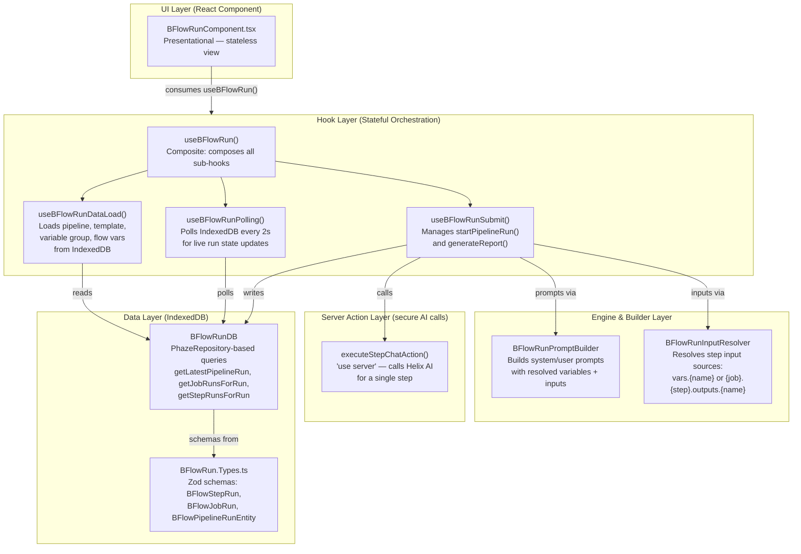
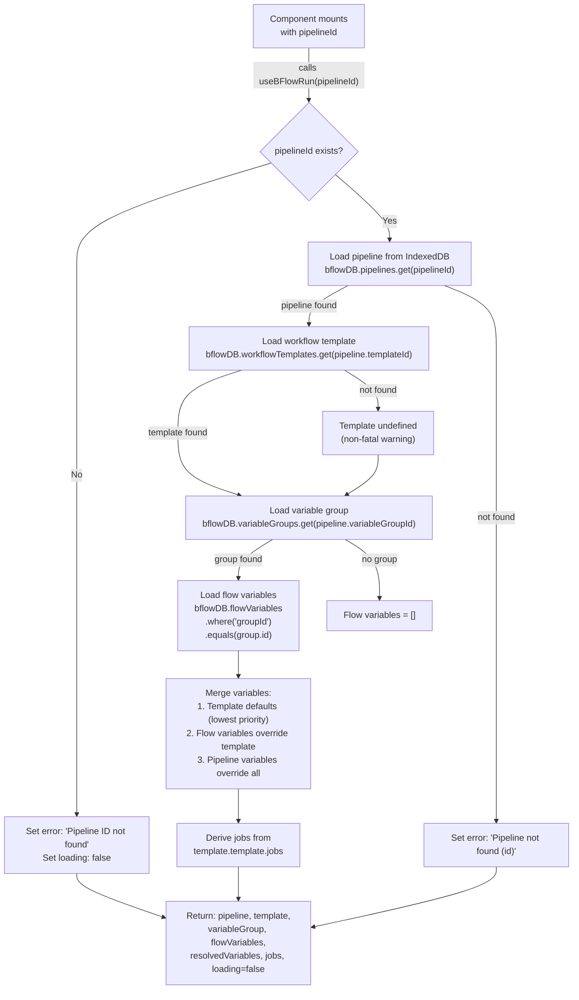
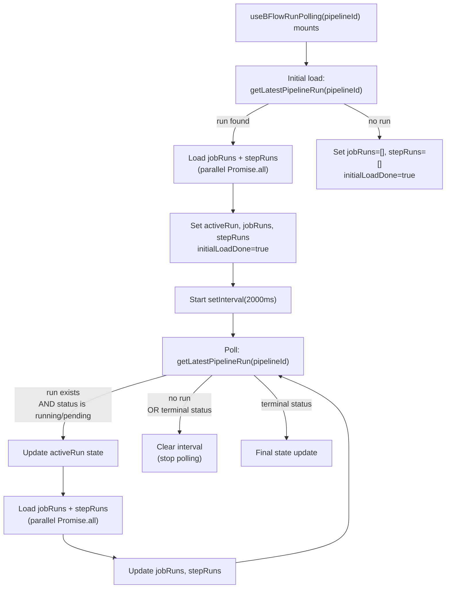
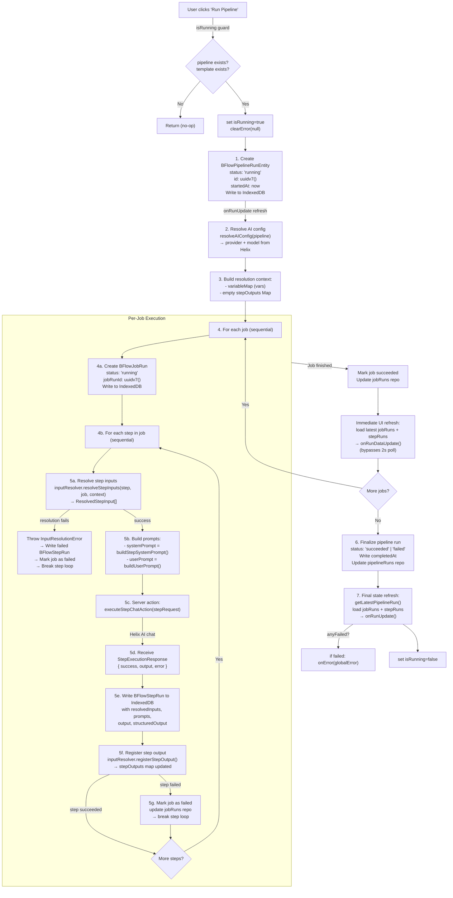
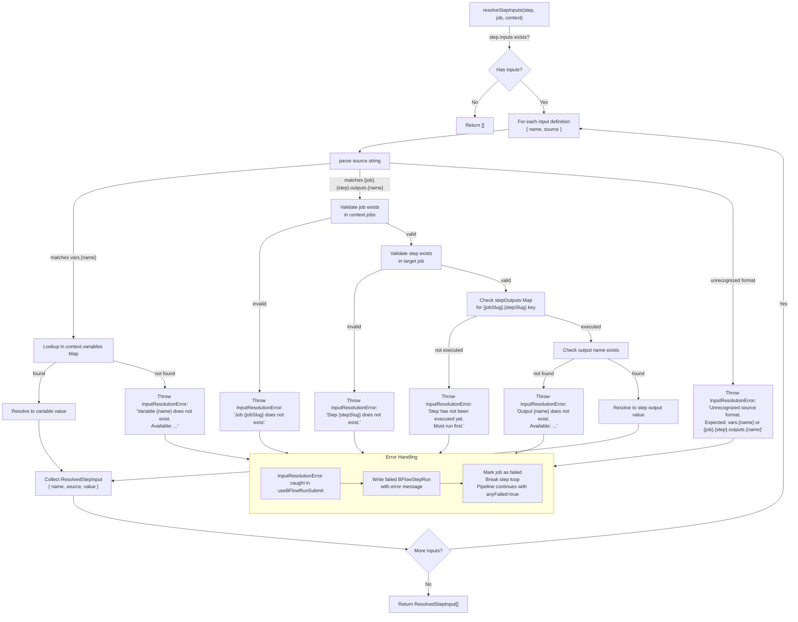
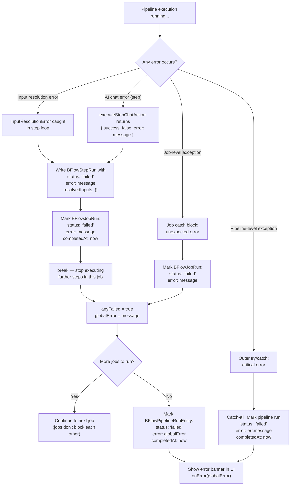
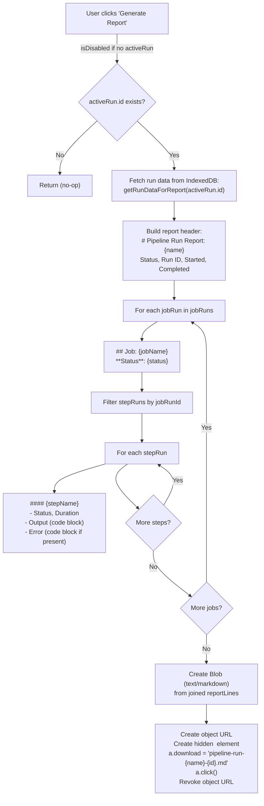
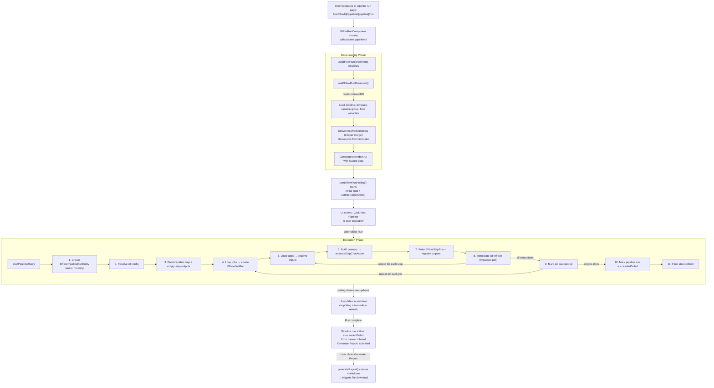

# BFlowRun — Pipeline Execution Flowchart

## Use Case & Purpose

**BFlowRun** is the execution engine and run-time UI for **BunnyFlow pipelines** — multi-step AI workflows
defined as YAML templates. A pipeline is composed of **Jobs** (logical work units) each containing a sequence
of **Steps** (individual AI chat calls to configurable LLM providers via Helix).

| Aspect            | Description                                                                                                                                                           |
| ----------------- | --------------------------------------------------------------------------------------------------------------------------------------------------------------------- |
| **Who uses it**   | End-users who configure and trigger AI pipelines from the UI                                                                                                          |
| **What it does**  | Orchestrates sequential job→step execution, resolves variables/inputs at each step, calls AI providers, tracks progress in IndexedDB, and presents real-time state    |
| **Why it exists** | To provide a **presentation-decoupled, testable** run view where the component is purely stateless and all logic lives in composable hooks + a dedicated engine class |

---

## Architecture Layers

---

## Initial Data Load Flow (useBFlowRunDataLoad)

---

## Polling Flow (useBFlowRunPolling)

---

## Pipeline Execution Flow (startPipelineRun)

---

## Input Resolution — Detailed Flow

---

## Prompt Building Flow (BFlowRunPromptBuilder)

```mermaid
flowchart TD
    BUILD["buildStepSystemPrompt(step, job, pipeline,<br/>resolvedVariables, resolvedInputs)"] --> INTRO["Append: 'You are executing step {name}<br/>in job {name} of a pipeline.'"]

    INTRO --> STEP_PROMPTS{"step.prompts exists?"}
    STEP_PROMPTS -->|"Yes"| APPEND_INSTRUCTIONS["Append: 'Instructions: {prompts}'<br/>(array joined by newlines)"]
    STEP_PROMPTS -->|"No"| SKIP_STEP_PROMPTS

    APPEND_INSTRUCTIONS --> JOB_PROMPT
    SKIP_STEP_PROMPTS --> JOB_PROMPT

    JOB_PROMPT{"job.prompt exists?"}
    JOB_PROMPT -->|"Yes"| APPEND_JOB_CTX["Append: 'Job Context: {prompt}'"]
    JOB_PROMPT -->|"No"| SKIP_JOB_CTX

    APPEND_JOB_CTX --> PIPELINE_PROMPT
    SKIP_JOB_CTX --> PIPELINE_PROMPT

    PIPELINE_PROMPT{"pipeline.prompt exists?"}
    PIPELINE_PROMPT -->|"Yes"| APPEND_PIPE_CTX["Append: 'Pipeline Context: {prompt}'"]
    PIPELINE_PROMPT -->|"No"| SKIP_PIPE_CTX

    APPEND_PIPE_CTX --> RESOLVED_INPUTS
    SKIP_PIPE_CTX --> RESOLVED_INPUTS

    RESOLVED_INPUTS{"resolvedInputs present<br/>and non-empty?"}
    RESOLVED_INPUTS -->|"Yes"| APPEND_INPUTS["Append: 'Resolved Inputs:'<br/>+ name=value pairs"]
    RESOLVED_INPUTS -->|"No"| SKIP_INPUTS

    APPEND_INPUTS --> VARIABLES
    SKIP_INPUTS --> VARIABLES

    VARIABLES{"resolvedVariables > 0?"}
    VARIABLES -->|"Yes"| APPEND_VARS["Append: 'Available variables:'<br/>+ name=value pairs"]
    VARIABLES -->|"No"| SKIP_VARS

    APPEND_VARS --> OUTPUT_FORMAT
    SKIP_VARS --> OUTPUT_FORMAT

    OUTPUT_FORMAT{"step.output defined<br/>and non-empty?"}
    OUTPUT_FORMAT -->|"Yes"| APPEND_JSON_INST["Append JSON output instructions:<br/>'Return valid JSON object with<br/>fields: {name}: {type}'<br/>+ strict formatting rules"]
    OUTPUT_FORMAT -->|"No"| SKIP_OUTPUT

    APPEND_JSON_INST --> RETURN
    SKIP_OUTPUT --> RETURN

    RETURN["Return joined string = systemPrompt<br/><br/>Then buildUserPrompt() appends:<br/>'Execute step {name} with inputs:{list}'<br/>or simple: 'Execute step {name}'"]
```

---

## Error Handling & Failure Propagation

---

## Report Generation Flow (generateReport)

---

## Complete End-to-End Sequence

---

## File Reference Map

| File                                                                                             | Role                                                                                            |
| ------------------------------------------------------------------------------------------------ | ----------------------------------------------------------------------------------------------- |
| [`BFlowRun.Component.tsx`](../../../src/modules/bunny-flow/src/run/BFlowRun.Component.tsx)       | Presentational React component — stateless, consumes `useBFlowRun()`                            |
| [`BFlowRun.Hooks.ts`](../../../src/modules/bunny-flow/src/run/BFlowRun.Hooks.ts)                 | All hooks: `useBFlowRun`, `useBFlowRunDataLoad`, `useBFlowRunPolling`, `useBFlowRunSubmit`      |
| [`BFlowRun.Types.ts`](../../../src/modules/bunny-flow/src/run/BFlowRun.Types.ts)                 | Zod schemas: `BFlowStepRun`, `BFlowJobRun`, `BFlowPipelineRunEntity`, `BFlowPipelineRunSummary` |
| [`BFlowRun.Prompt.ts`](../../../src/modules/bunny-flow/src/run/BFlowRun.Prompt.ts)               | `BFlowRunPromptBuilder` — constructs system/user prompts with variable substitution             |
| [`BFlowRun.InputResolver.ts`](../../../src/modules/bunny-flow/src/run/BFlowRun.InputResolver.ts) | `BFlowRunInputResolver` — resolves `vars.{name}` and `{job}.{step}.outputs.{name}` sources      |
| [`BFlowRun.Actions.ts`](../../../src/modules/bunny-flow/src/run/BFlowRun.Actions.ts)             | Server actions (`'use server'`) — `executeStepChatAction`, `executePipelineRunAction`           |
| [`BFlowRunDB.ts`](../../../src/modules/bunny-flow/src/run/BFlowRunDB.ts)                         | IndexedDB access layer — convenience queries over PhazeRepository                               |
| [`BFlowAIEngine.ts`](../../../src/modules/bunny-flow/src/run/BFlowAIEngine.ts)                   | Alternative server-side engine — full pipeline orchestration with topological job ordering      |
