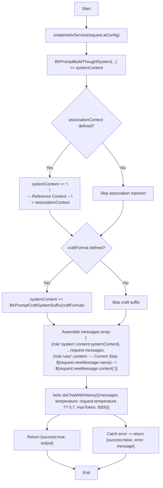

```mermaid
flowchart TD
    A[Start] --> B["createHelixService(request.aiConfig)"]
    B --> C["BKPromptBuildThoughtSystem(...) => systemContent"]
    C --> D{associationContext defined?}
    D -->|Yes| E["systemContent += '\\n\\n--- Reference Context ---\\n' + associationContext"]
    D -->|No| F[Skip association injection]
    E --> G{craftFormat defined?}
    F --> G
    G -->|Yes| H["systemContent += BKPromptCraftSystemSuffix(craftFormat)"]
    G -->|No| I[Skip craft suffix]
    H --> J["Assemble messages array:\n[ {role:'system',content:systemContent}, ...request.messages, {role:'user',content:`--- Current Step: ${request.newMessage.name}---\\n${request.newMessage.content}`}]"]
    I --> J
    J --> K["helix.doChatWithHistory({messages, temperature: request.temperature ?? 0.7, maxToken: 8000})"]
    K --> L["Return {success:true, output}"]
    K --> M["Catch error -> return {success:false, error: message}"]
    L --> Z[End]
    M --> Z
```