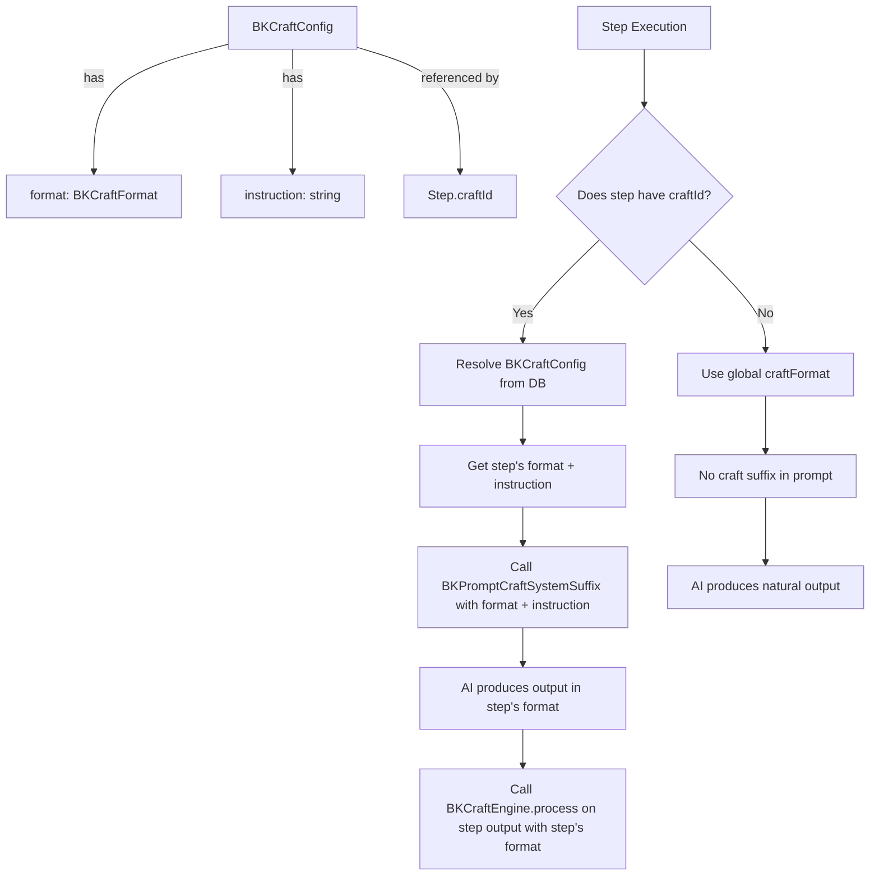
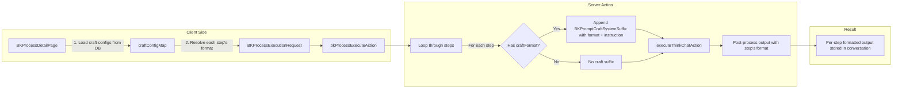

# Plan: Per-Step Craft Format Execution

## Problem Summary

Each train-of-thought step has a `craftId` field that references a `BKCraftConfig` (which has a `format` and an `instruction`). However, the current code has several bugs:

1. **Only the GLOBAL `craftFormat` is used**: Both [`BKProcess.Actions.ts:160`](src/modules/bunny-thinker/src/process/BKProcess.Actions.ts:160) and [`BKThinkStudio.tsx:507`](src/modules/bunny-thinker/src/think-studio/BKThinkStudio.tsx:507) do `craftFormat: step.craftId ? craftFormat : undefined` — when a step HAS a `craftId`, it uses the global `craftFormat` instead of looking up the step's SPECIFIC format from the `BKCraftConfig` that `craftId` points to.

2. **`customInstruction` from BKCraftConfig is never passed**: The [`BKCraftConfig`](src/modules/bunny-thinker/src/craft/BKCraft.Types.ts:21) has an `instruction` field, and [`BKPromptBuildCraftInstruction`](src/modules/bunny-thinker/src/craft/BKCraft.Prompt.ts:12) accepts a `customInstruction` parameter, but neither [`executeThinkChatAction`](src/modules/bunny-thinker/src/think/BKThink.Actions.ts:173) nor [`bkProcessExecuteAction`](src/modules/bunny-thinker/src/process/BKProcess.Actions.ts:118) ever passes the step's custom instruction.

3. **Post-processing uses global craftFormat only**: After AI execution, [`BKCraftEngine.process()`](src/modules/bunny-thinker/src/craft/BKCraft.Engine.ts:27) is called on the FINAL output only, using the global `craftFormat`. This means per-step craft formats are completely ignored for post-processing.

## Architecture Overview



## Changes Required

### 1. [`src/modules/bunny-thinker/src/process/BKProcess.Actions.ts`](src/modules/bunny-thinker/src/process/BKProcess.Actions.ts)

#### 1a. Update `BKProcessExecutionRequest.trainOfThoughts` type (line 43-48)

Add a `craftFormat` and `craftInstruction` field to each step entry so the server action knows the step's specific format, rather than just having `craftId`:

```typescript
trainOfThoughts: Array<{
  id: string;
  name: string;
  thought: string;
  craftId?: string | null;
  craftFormat?: BKCraftFormat | null;  // NEW: resolved format
  craftInstruction?: string | null;    // NEW: resolved instruction
}>;
```

#### 1b. Fix step execution loop (line 137-184)

Replace the global `craftFormat` usage with a per-step resolved format:

- **Line 160**: Change `craftFormat: step.craftId ? craftFormat : undefined` to `craftFormat: step.craftFormat ?? undefined`
- **Also pass `craftInstruction`** to `executeThinkChatAction`: add `craftInstruction: step.craftInstruction ?? undefined`
- **Post-processing (line 188-196)**: Instead of processing only the FINAL output with global `craftFormat`, process EACH step's output with its own format. OR alternatively, process only the last step with its specific format.

### 2. [`src/modules/bunny-thinker/src/think/BKThink.Actions.ts`](src/modules/bunny-thinker/src/think/BKThink.Actions.ts)

#### 2a. Add `craftInstruction` to `BKThinkChatRequest` (line 66-70)

```typescript
craftFormat?: BKCraftFormat;
craftInstruction?: string;  // NEW: custom instruction from BKCraftConfig
```

#### 2b. Use `craftInstruction` when building craft suffix (line 172-175)

Change:
```typescript
if (request.craftFormat) {
  systemContent += BKPromptCraftSystemSuffix(request.craftFormat);
}
```
To:
```typescript
if (request.craftFormat) {
  systemContent += BKPromptCraftSystemSuffix(request.craftFormat, request.craftInstruction);
}
```

### 3. [`src/modules/bunny-thinker/src/process/BKProcessDetailPage.tsx`](src/modules/bunny-thinker/src/process/BKProcessDetailPage.tsx)

#### 3a. Load craft configs and resolve per-step format (around line 416-435)

Before building the `BKProcessExecutionRequest`, load the craft configs from IndexedDB and resolve each step's format:

```typescript
// Load all craft configs to resolve per-step formats
const allCraftConfigs = await bkThinkerDB.craftConfigs.toArray();
const craftConfigMap = new Map(allCraftConfigs.map(c => [c.id, c]));

const request: BKProcessExecutionRequest = {
  ...
  trainOfThoughts: trainOfThoughts.map((tot) => {
    const craftConfig = tot.craftId ? craftConfigMap.get(tot.craftId) : null;
    return {
      id: tot.id,
      name: tot.name,
      thought: tot.thought,
      craftId: tot.craftId,
      craftFormat: craftConfig?.format ?? null,
      craftInstruction: craftConfig?.instruction ?? null,
    };
  }),
  ...
};
```

### 4. [`src/modules/bunny-thinker/src/think-studio/BKThinkStudio.tsx`](src/modules/bunny-thinker/src/think-studio/BKThinkStudio.tsx)

#### 4a. Load craft configs and resolve per-step format (around line 405-475)

Similar to the process detail page, load craft configs and resolve each train-of-thought step's format before executing:

```typescript
// Before the step execution loop, load craft configs
const allCraftConfigs = await bkThinkerDB.craftConfigs.toArray();
const craftConfigMap = new Map(allCraftConfigs.map(c => [c.id, c]));

// Then in the step execution loop (line 507):
const stepCraftConfig = step.craftId ? craftConfigMap.get(step.craftId) : null;
const response = await executeThinkChatAction({
  ...
  craftFormat: stepCraftConfig?.format ?? undefined,
  craftInstruction: stepCraftConfig?.instruction ?? undefined,
  ...
});
```

#### 4b. Post-process each step output with its specific format (line 542-549)

Instead of only processing the final output, process each step's AI output with its specific format:

```typescript
// After receiving response for each step:
if (response.success) {
  const stepFormat = stepCraftConfig?.format ?? craftFormat;
  const processed = BKCraftEngine.process(response.output, stepFormat);
  // Store per-step processed output for display
}
```

### 5. [`src/modules/bunny-thinker/src/think-studio/BKThinkStudioAnonHooks.ts`](src/modules/bunny-thinker/src/think-studio/BKThinkStudioAnonHooks.ts)

The anonymous think studio hooks also use `craftFormat` globally. Apply the same pattern:
- Resolve `BKCraftConfig` per step using the step's `craftId`
- Pass per-step `craftFormat` and `craftInstruction` to `executeThinkChatAction`

## Data Flow Diagram



## Validation Checklist

After implementation, verify:

1. Each step with a `craftId` assigned gets its SPECIFIC format sent to the AI (not the global one)
2. Each step's custom `instruction` from `BKCraftConfig` is passed to the AI prompt
3. The AI output for each step is post-processed through `BKCraftEngine.process()` with the step's specific format
4. Steps without a `craftId` continue to use the global `craftFormat` (or default to markdown)
5. The BKStudio (non-anonymous) and Process execution paths both work correctly
6. The anonymous think studio (`BKThinkStudioAnon`) also respects per-step craft formats